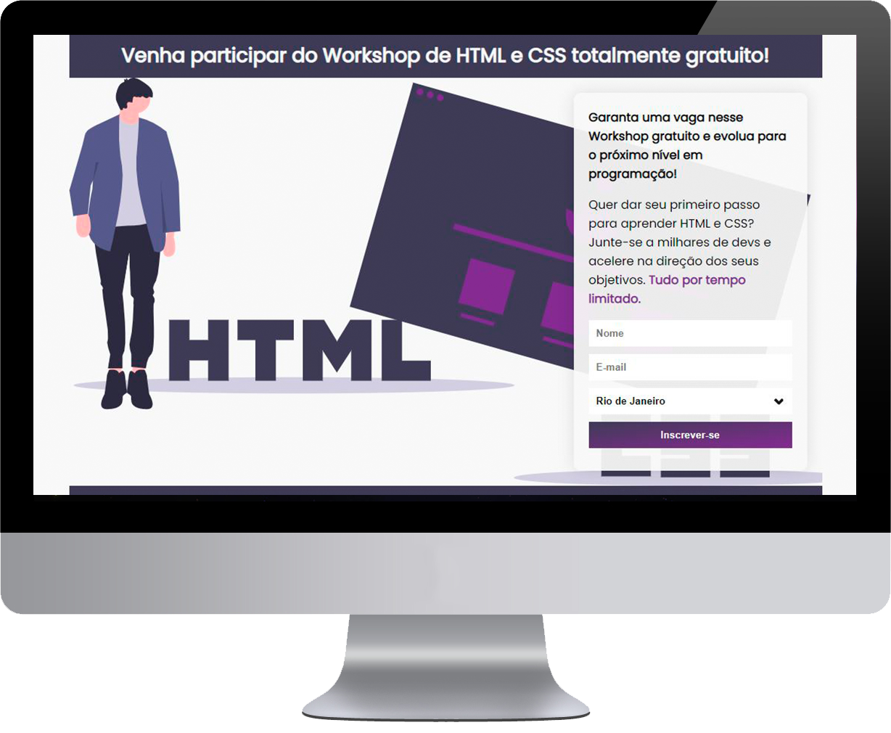
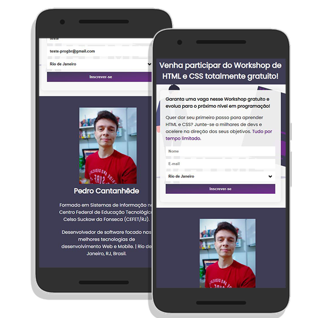
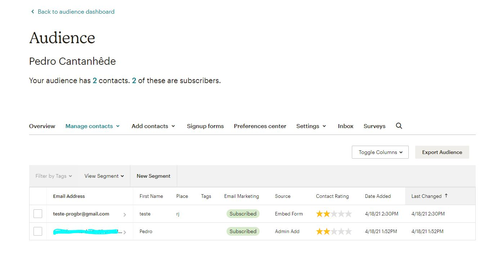
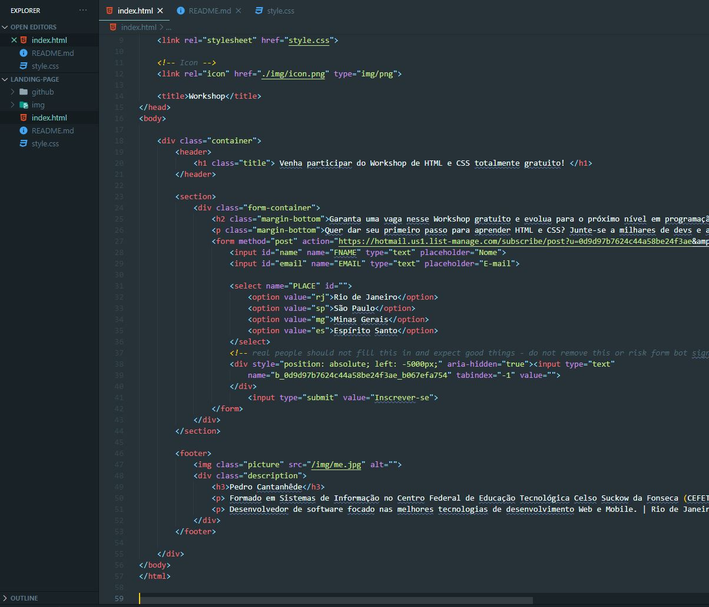

# Landing page (Página de Captura)
Projeto realizado no curso Programador BR com o intuito de adquirir conhecimento em HTML e CSS. Páginas de captura são conhecidas por serem usadas a fim de conseguir visitantes, para então torná-los possíveis clientes (*leads*).

  
  

## :rocket: Com o que trabalhamos? 
✅ HTML

✅ CSS

✅ Mailchimp

## :monkey_face: MailChimp

Utilizamos esta plataforma que envia um e-mail sobre as informações do workshop para cada pessoa que se inscreveu. Além de cadastrar o contato do cliente que enviou o formulário.

## Características do Site

✔ Responsividade 

✔ Cabeçalho

✔ Seção de Conteúdo

✔ Formulário com Select

✔ Seção Footer (Rodapé)

## Código

